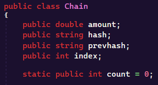
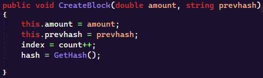
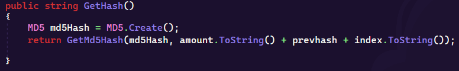
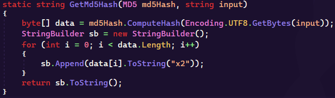
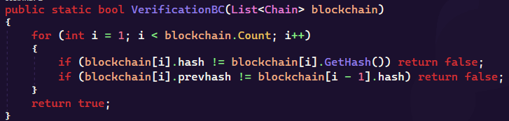
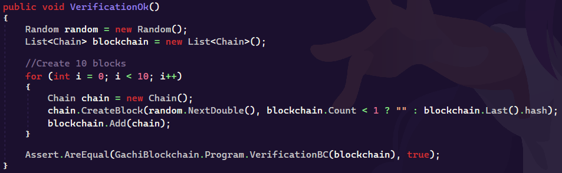
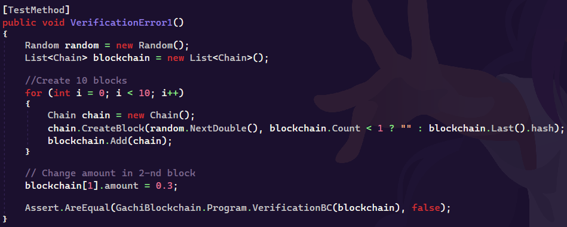
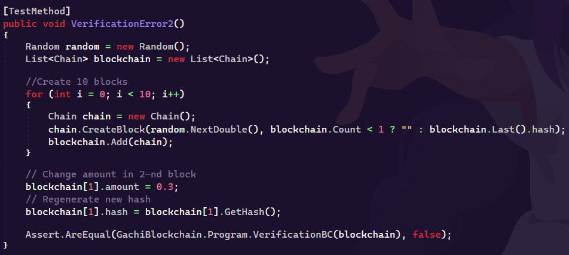

# Course Distributed Lab
## Практичне завдання №2
### Базовий код

Мова програмування: `C#`

#### Функціонал
- Створення 10 блоків з випадковою кі-стю монет
- Верифікація блоків

#### Тестування
- Тестування блокчейну без змін
- Тестування блокчейну зі зміною суми в одному з блоків
- Тестування блокчейну зі зміною суми в одному з блоків і регенерацією хеша

#### Опис коду

```
Клас Chain = один блок.
В собі цей клас має такі параметри:
    - Кі-сть монет
    - Хеш
    - Хеш попереднього блоку
```


```
Метод CreateBlock класу Chain створює новий блок.
Цей метод приймає кі-сть монет та хеш попереднього блоку.
```


```
Для генерації хешу, використовується метод GetHash, який за допомогою методу GetMd5Hash (див. нижче) шифрує текст, який представляє з себе конкатенацію кі-сті монет, попереднього хешу та індексу в md5.
```


```
Метод GetMd5Hash шифрує заданий текст в md5.
```


```
В основному класі знаходиться метод VerificationBC, який приймає блоки.
Даний метод перевірає цілісність блокчейну.
Якщо хоча б в одному блоці буде порушене його хеш значення або хеш значення поперенього блоку, метод поверне false і в такому випадку, блокчейн не буде верифікованим.
```

```
В данному проекті ми реалізували 3 тестування.
```


```
Перше тестування - VerificationOk перевіряє чи проходить перевірку блокчейн, який не піддавався змінам після його створення.

Очікуваний результат: true
```


```
Друге тестування - VerificationError1 перевіряє чи пройде перевірку блокчейн, який піддався зміні кі-сті монет у одному з блоків.

Очікуваний результат: false
```


```
Третє тестування - VerificationError2 перевіряє чи пройде перевірку блокчейн, який піддався зміні кі-сті монет у одному з блоків та в якому перегенерували хеш.

Очікуваний результат: false
```
